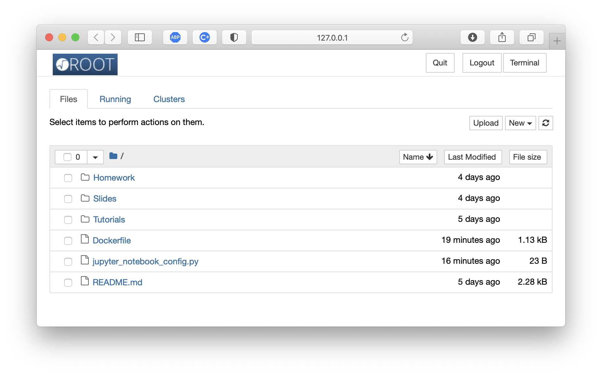

# ESIPAP 2021 - Experimental Particle Physics

## Slides

The slides of the lectures will appear in [this directory](Slides) as the course proceeds. 

Since this year the course will be held remotely because  the pandemics, the PDF of the next lecture will be made available *before* the lecture itself to allow you to better follow.

## Homework

I will sometime leave things to do by yourself, either alone or in small groups, in order to consolidate what we learned during the lectures. Instructions and material will appear in the [Homework](Homework) directory.

## Tutorials

Every once in a while, we will do simple calculations and data analysis exercises. 
We will use [ROOT](https://root.cern) and [Python](https://www.python.org) with [Jupyter](https://jupyter.org) notebooks, that will appear in the [Tutorials](Tutorials) directory. 

You have several options to run these notebooks:

- You already have a local setup version of Python3 and ROOT (with Python support enabled) installed on your computer: clone or download the repository, and run the notebooks locally.

- You have a CERN account, and you know how to use [SWAN](http://swan.cern.ch): clone the repository on your CERNBox area to access and run the notebooks.

- You would like to run Python and ROOT on your computer, but you don't have them installed and you are not sure about how to properly do it. In this case, the safest option is to use [Docker](https://www.docker.com), and to use the container that already have the proper setup. Here's is a quick list of instructions:
   * Install [Docker Desktop](https://www.docker.com/products/docker-desktop) for you OS;
   * Once done, make sure you can run the `docker` command from a terminal;
   * Clone or download the ESIPAP-2021 repository (this one!), `cd` to the main directory;
   * From the command line, run the command `docker run --rm -p 8888:8888 marcodelmastro/esipap:latest`
   * You should see on the screen a series of messages, including one with a `http` address similar to this (**the token string will be different!**):
   
     `http://127.0.0.1:8888/?token=5666c2fc6015b0e0310382076f31ad9df7f2afc2694090ff`

   * Copy and paste the address in your browser, and you should land on a page like this one:
   
   

- If none of the above works for you, you can launch a standalone [MyBinder](https://mybinder.org) environment using the other button below: it will give you a working setup with Python and ROOT, that will allow you to run the notebooks from the browser. Please note that in this case any change you make will be lost unless you copy them elsewhere.

**Go to the [Tutorials](Tutorials) directory and execute the [example notebook](Tutorials/TestSetup.ipynb) there to verify your setup!**

If you never used Python before, fear not! It's rather easy to get the grip of the basics. You can use the excellent [Crash Course](https://github.com/rpmuller/PythonCrashCourse) by [Rick Muller](http://www.cs.sandia.gov/~rmuller/) to get started.
